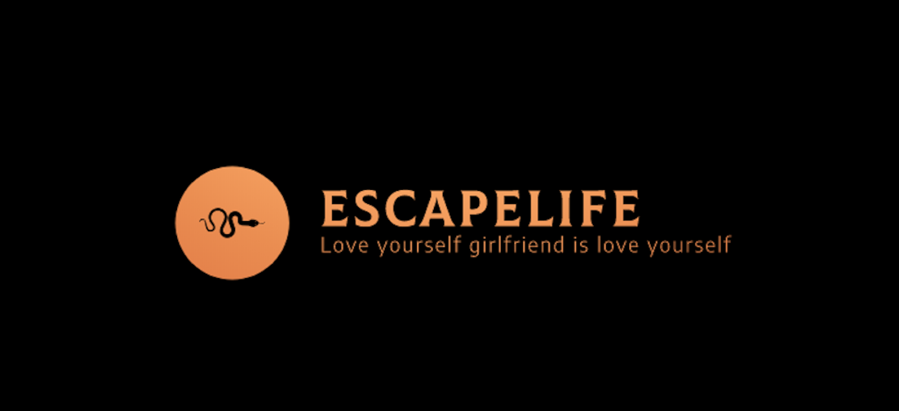

<p align=center>
  <a href="https://github.com/EscapeLife/love_grilfriend.git">
    
  </a>
</p>

<p align=center>
  <b>love_girlfriend ❤️爱自己女朋友就是爱自己</b>
</p>

<p align="center">
  <a href="https://github.com/EscapeLife/love_grilfriend.git"></a>
  <a href="https://github.com/EscapeLife/love_grilfriend.git"></a>
  <a href="https://github.com/EscapeLife/love_grilfriend.git"></a>
  <a href="https://github.com/EscapeLife/love_grilfriend.git"></a>
</p>



## 1. 项目介绍

> **👊 女朋友 -> 老婆 👰🏻**

俗话说得好，爱自己的女朋友就是爱自己。那问题的关键就来了，我们需要怎么爱呢？该项目就是为了关心女友而创建，借鉴 [EverydayWechat](https://github.com/sfyc23/EverydayWechat) 项目，主要包含以下爱护功能：

- **每日定时给好友发送特定消息**
  - 暖心话
  - 定时提醒
- **机器人自动回复好友消息**
  - 忙碌时自动回复
  - 非工作时间勿扰
- **附加扩展功能**
  - 天气信息
  - 每日一句
  - 每日诗歌
  - 票房数据

## 2. API 接口

> **介绍项目中主要使用的 API 接口信息**

- **天气信息**
  - [**`SOJSON`**](sojson.com/blog/305.html)
  - [**`RollToolsApi`**](https://github.com/MZCretin/RollToolsApi#%E8%8E%B7%E5%8F%96%E7%89%B9%E5%AE%9A%E5%9F%8E%E5%B8%82%E4%BB%8A%E6%97%A5%E5%A4%A9%E6%B0%94)
- **每日一句**
  - [**`One`**](http://wufazhuce.com)
  - [**`一言`**](hitokoto.cn)
- **智能机器人**
  - [**`腾讯智能闲聊`**](ai.qq.com/product/nlpchat.shtml)
- **票房数据**
  - [**`猫眼实时票房`**](piaofang.maoyan.com/dashboard)
- **空气质量**
  - [**`aqicn`**](http://aqicn.org/here)

## 3. 配置文件

> **介绍配置文件的配置方式和方法**

```yaml

```

## 4. 效果展示

> **请看效果截图**


## 5. 计划列表

> **准备或者预计实现的功能和特性**

- 将定时发送消息转换成图片形式
- 附加扩展功能支持每日诗歌
- 附加扩展功能支持地图查询([高德地图](https://lbs.amap.com/)|[腾讯地图](https://lbs.qq.com/webservice_v1/index.html))
- 附加扩展功能支持新闻资讯([feedly](https://developer.feedly.com/)|[HackerNews](https://github.com/HackerNews/API)|[纽约时报](https://developer.nytimes.com/))
- 附加扩展功能支持图片摄影([px500](https://github.com/500px/legacy-api-documentation))

## 6. 参考项目

> **下面是该项目参考项目**

- [**`ItChat` - 微信个人号接口、微信机器人及命令行微信**](https://github.com/littlecodersh/ItChat)
- [**`EverydayWechat` - 基于 Python3 与 Itchat 的微信小工具**](https://github.com/sfyc23/EverydayWechat)
- [**`daily-warm` - 每天定时发邮件给你关心的人**](https://github.com/BarryYan/daily-warm)

## 7. 联系方式

> **以下是我的个人联系方式**

<p align="center">
    
</p>

- **💭 [Name] 💭**
  - 🐠 **[`EscapeLife`](https://www.escapelife.site)** 😏
- **💭 [Induction] 💭**
  - 🏦 **[`Focusing P.A.I`](https://www.paodingai.com)** 😂
- **💭 [Email] 💭**
  - 📫 **[`wenpanhappy@gmail.com`](https://www.escapelife.site)** 🤔
- **💭 [Myblog] 💭**
  - 🍺 **[`https://www.escapelife.site`](https://www.escapelife.site)** 😚
- **💭 [License] 💭**
  - 🚧 [**`Apache License, Version 2.0`**](http://www.apache.org/licenses/LICENSE-2.0.html)😝
